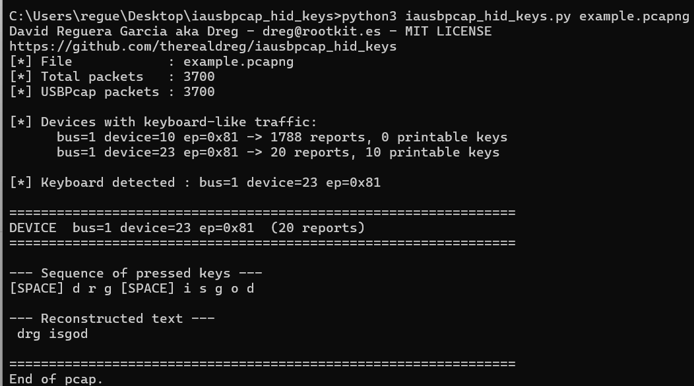

# iausbpcap_hid_keys

Extract HID keyboard keystrokes from a [USBPcap](https://desowin.org/usbpcap/) capture.

https://www.wireshark.org/download.html

Reads a `.pcap`/`.pcapng`, finds the keyboard HID reports (8-byte interrupt IN transfers), decodes them, and prints the full key sequence plus the reconstructed text (with Backspace, Shift and Caps Lock applied).

Pure Python 3, no external dependencies: the pcap/pcapng container and the USBPcap header are parsed directly.



## Usage

```sh
python3 iausbpcap_hid_keys.py capture.pcap
python3 iausbpcap_hid_keys.py capture.pcapng -v
python3 iausbpcap_hid_keys.py capture.pcap --device 2
python3 iausbpcap_hid_keys.py capture.pcap --all-devices
```

By default it auto-selects the device with the most printable keystrokes.

## Options

| Flag | Description |
|------|-------------|
| `-d, --device N` | Process only device address `N` |
| `-a, --all-devices` | Process every detected device |
| `-v, --verbose` | Dump each report in hex |
| `--no-backspace` | Do not apply Backspace edits to the reconstructed text |

## Keyboard layout

The key table assumes a **US layout**. HID reports carry the physical key code (Usage ID), not the final character, so other layouts (e.g. Spanish AltGr combinations) need their own table.
